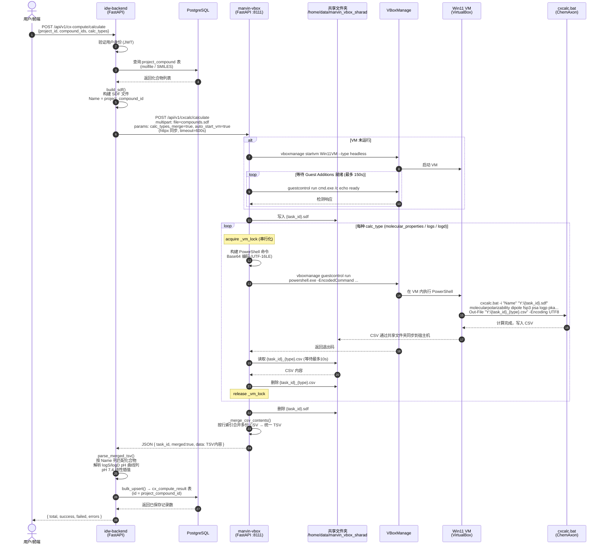
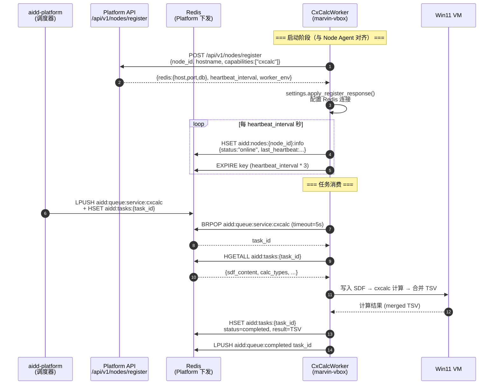

# Marvin cxcalc API

通过 VirtualBox 运行 Windows 11 虚拟机，在其中安装 ChemAxon MarvinBeans，并封装为 FastAPI REST API 服务。

## 目录

- [1. 安装 VirtualBox](#1-安装-virtualbox)
- [2. 创建 Windows 11 虚拟机](#2-创建-windows-11-虚拟机)
- [3. 启动虚拟机 & 安装 Windows](#3-启动虚拟机--安装-windows)
- [4. 安装 VirtualBox Guest Additions](#4-安装-virtualbox-guest-additions)
- [5. 安装 MarvinBeans (cxcalc)](#5-安装-marvinbeans-cxcalc)
- [6. 配置共享文件夹 & 启动 API](#6-配置共享文件夹--启动-api)
- [7. Worker 模式 & 平台集成](#7-worker-模式--平台集成)
- [8. API 使用说明](#8-api-使用说明)
- [9. 手动命令行使用 (Shell)](#9-手动命令行使用-shell)
- [10. 配置项](#10-配置项)
- [11. 故障排查](#11-故障排查)

---

## 1. 安装 VirtualBox

```bash
# 安装 VirtualBox deb 包
sudo apt install -y /home/songyou/projects/mavin-virtualbox/virtualbox-7.2_7.2.6-172322~Ubuntu~noble_amd64.deb

# 安装 Extension Pack（支持 VRDE 远程桌面、USB 等）
sudo vboxmanage extpack install --replace Oracle_VirtualBox_Extension_Pack-7.2.6.vbox-extpack
```

---

## 2. 创建 Windows 11 虚拟机

```bash
# 创建 VM 存储目录
sudo mkdir -p /home/data/vbox_vms
sudo chown -R $USER:$USER /home/data/vbox_vms

# 创建并注册虚拟机
vboxmanage createvm --name "Win11VM" --ostype "Windows11_64" --register \
  --basefolder /home/data/vbox_vms

# 配置 VM 硬件参数
#   内存 8GB, 4核, 128MB 显存, EFI 固件, TPM 2.0 (Win11 必需), VRDE 远程桌面端口 3399
vboxmanage modifyvm "Win11VM" \
  --memory 8192 --cpus 4 --vram 128 \
  --graphicscontroller vboxsvga \
  --firmware efi --tpm-type 2.0 \
  --vrde on --vrdeport 3399

# 添加 SATA 存储控制器
vboxmanage storagectl "Win11VM" --name "SATA" --add sata --controller IntelAhci

# 创建 60GB 虚拟硬盘
vboxmanage createmedium disk \
  --filename /home/data/vbox_vms/Win11VM/Win11VM.vdi \
  --size 61440 --format VDI

# 挂载 Windows 11 ISO 安装镜像
vboxmanage storageattach "Win11VM" --storagectl "IDE" --port 0 --device 0 \
  --type dvddrive \
  --medium /home/songyou/projects/mavin-virtualbox/zh-cn_windows_11_business_editions_version_25h2_updated_feb_2026_x64_dvd_7bd4278f.iso
```

---

## 3. 启动虚拟机 & 安装 Windows

```bash
# 检查 KVM 是否被其他进程占用（如 libvirt/QEMU）
sudo lsof /dev/kvm
sudo virsh list --all

# 如果 KVM 被占用，先卸载 kvm_intel 模块
sudo rmmod kvm_intel

# 以无头模式启动虚拟机
vboxmanage startvm "Win11VM" --type headless
```

通过 VRDE 远程桌面连接 VM 完成 Windows 安装：
```bash
# 从远程客户端使用 RDP 连接（端口 3399）
# rdesktop <服务器IP>:3399
# 或使用任意 RDP 客户端连接
```

Windows 安装完成后，创建用户：
- **用户名**: `marvin-box`
- **密码**: `123123`

---

## 4. 安装 VirtualBox Guest Additions

在 VM 内安装 Guest Additions（必须，用于共享文件夹和 guestcontrol 功能）：

```bash
# 在宿主机挂载 Guest Additions ISO
vboxmanage storageattach "Win11VM" --storagectl "IDE" --port 0 --device 0 \
  --type dvddrive \
  --medium /usr/share/virtualbox/VBoxGuestAdditions.iso
```

然后在 VM 内运行 `D:\VBoxWindowsAdditions.exe` 完成安装，重启 VM。

验证 Guest Additions 生效：
```bash
# 在宿主机测试 guestcontrol
vboxmanage guestcontrol "Win11VM" run \
  --exe "C:\Windows\System32\cmd.exe" \
  --username "marvin-box" --password "123123" \
  --wait-stdout \
  -- cmd.exe /c echo hello
# 应输出: hello
```

---

## 5. 安装 MarvinBeans (cxcalc)

### 5.1 安装 Java 运行环境（JRE 8 32位）

> **必须使用 32 位 JRE**，因为 MarvinBeans (cxcalc) 是 32 位应用程序，需要 32 位 JVM 才能正常运行。

安装包：`jre-8u202-windows-i586.exe`（i586 即 32 位）

```bash
# 通过 guestcontrol 将 JRE 安装包复制到 VM
vboxmanage guestcontrol "Win11VM" copyto \
  --username "marvin-box" --password "123123" \
  --target-directory "C:\Users\marvin-box\Desktop" \
  /home/songyou/projects/marvin-vbox/jre-8u202-windows-i586.exe
```

在 VM 中静默安装（通过 guestcontrol 执行，或在 VM 桌面中双击运行）：

```bash
vboxmanage guestcontrol "Win11VM" run \
  --exe "C:\Users\marvin-box\Desktop\jre-8u202-windows-i586.exe" \
  --username "marvin-box" --password "123123" \
  --wait-stdout --wait-stderr \
  -- jre-8u202-windows-i586.exe /s REBOOT=0
```

> `/s` 为静默安装，`REBOOT=0` 安装完成后不重启。

验证 JRE 安装成功：

```bash
vboxmanage guestcontrol "Win11VM" run \
  --exe "C:\Windows\System32\cmd.exe" \
  --username "marvin-box" --password "123123" \
  --wait-stdout \
  -- cmd.exe /c java -version
# 应输出类似: java version "1.8.0_202"
```

> **注意**: 如果需要重新下载 JRE 8 32位安装包，可从 Oracle 官网获取：
> `jre-8uXXX-windows-i586.exe`（i586 = 32位 x86）

### 5.2 安装 MarvinBeans

将 `Marvin.zip` 解压后复制到 VM 并安装：

```bash
# 解压 Marvin.zip（如需）
# unzip Marvin.zip -d /tmp/marvin_install

# 通过 guestcontrol 将安装文件复制到 VM
vboxmanage guestcontrol "Win11VM" copyto \
  --username "marvin-box" --password "123123" \
  --target-directory "C:\Users\marvin-box\Desktop" \
  /home/songyou/projects/marvin-vbox/Marvin.zip
```

在 VM 内解压并运行安装程序，默认安装路径：
```
C:\Program Files (x86)\ChemAxon\MarvinBeans\
```

### 5.3 验证 cxcalc 可用

```bash
vboxmanage guestcontrol "Win11VM" run \
  --exe "C:\Windows\System32\cmd.exe" \
  --username "marvin-box" --password "123123" \
  --wait-stdout \
  -- cmd.exe /c "C:\Program Files (x86)\ChemAxon\MarvinBeans\bin\cxcalc.bat" -h
```

---

## 6. 配置共享文件夹 & 启动 API

### 6.1 一键配置（推荐）

```bash
cd /home/songyou/projects/marvin-vbox

# 运行一次性配置脚本（创建共享文件夹 + 安装 Python 依赖）
./setup_shared_folder.sh
```

该脚本会：
1. 创建宿主机共享目录 `/home/data/marvin_vbox_sharad`
2. 配置 VirtualBox 共享文件夹，自动挂载到 VM 的 `Z:\shared`
3. 安装 Python 依赖（fastapi, uvicorn, python-multipart）

### 6.2 手动配置

```bash
# 创建宿主机共享目录
sudo mkdir -p /home/data/marvin_vbox_sharad
sudo chown -R $USER:$USER /home/data/marvin_vbox_sharad

# 添加共享文件夹到 VM（VM 关机状态下执行）
vboxmanage sharedfolder add "Win11VM" --name "shared" \
  --hostpath "/home/data/marvin_vbox_sharad" \
  --automount --auto-mount-point "Z:\\"

# 安装 Python 依赖
pip install -r requirements.txt
```

### 6.3 启动 API 服务

```bash
cd /home/songyou/projects/marvin-vbox
python run.py
```

服务启动后：
- API 地址: `http://0.0.0.0:8111`
- Swagger 文档: `http://localhost:8111/docs`
- 健康检查: `http://localhost:8111/api/v1/cxcalc/health`

> **注意**: API 会在收到请求时自动启动 VM（如果 VM 未运行）。

---

## 7. Worker 模式 & 平台集成

marvin-vbox 同时运行 **REST API 服务** 和 **CxCalcWorker**（Redis 队列消费者），由 `run.py` 通过 `asyncio.gather` 并发启动。

CxCalcWorker 的注册机制与 **aidd-toolkit Node Agent 完全对齐**：启动时只需 `PLATFORM_URL`，向 Platform 注册为节点，所有基础设施配置（Redis、心跳间隔等）由 Platform 统一下发。

### 7.1 架构概览

```
aidd-platform (8333)                      marvin-vbox (8111)
┌───────────────────────┐                 ┌──────────────────────────────┐
│                       │                 │  run.py                      │
│  POST /nodes/register │◄── 注册 ────────│  ├─ FastAPI (REST :8111)     │
│  → 返回 redis 配置     │                 │  └─ CxCalcWorker             │
│    heartbeat_interval │                 │     ├─ _register_node()      │
│    worker_env         │                 │     ├─ _heartbeat_loop()     │
│                       │                 │     │   (Redis HSET)         │
│  Redis (下发的配置)    │                 │     └─ _consume_loop()       │
│  LPUSH cxcalc queue  ─┼────────────────►│         BRPOP 取任务         │
│  HSET 心跳 key       ◄┼────────────────┤         心跳上报              │
└───────────────────────┘                 └──────────────────────────────┘
```

### 7.2 启动流程

```
                只需配置 PLATFORM_URL
                        │
                        ▼
        ┌───────────────────────────────┐
        │ POST /api/v1/nodes/register   │
        │  → 获取 redis{host,port,db}   │
        │  → 获取 heartbeat_interval    │
        │  → 获取 worker_env           │
        └───────────────┬───────────────┘
                        │ 成功
                        ▼
              连接 Redis (Platform 下发)
                        │
              ┌─────────┴──────────┐
              ▼                    ▼
      Redis HSET 心跳       BRPOP 消费循环
      (与 Node Agent 一致)   aidd:queue:service:cxcalc
```

1. **节点注册**：CxCalcWorker 启动时自动生成 `node_id`（算法与 Node Agent 一致：`hostname-mac_hash[:8]`），向 `POST {PLATFORM_URL}/api/v1/nodes/register` 注册。Platform 返回完整的基础设施配置（Redis 连接信息、心跳间隔、worker_env 等）。
2. **连接 Redis**：使用 Platform 下发的 `redis.host`/`redis.port`/`redis.db` 构建连接 URL。
3. **心跳**：通过 Redis `HSET aidd:nodes:{node_id}:info` 上报状态（与 Node Agent 相同机制），key 设置 TTL = `heartbeat_interval * 3`。
4. **消费循环**：从 `aidd:queue:service:cxcalc` BRPOP 取任务，执行 VM 计算，结果回写到 Redis。

> **降级安全**：Platform 不可达时，若 `.env` 中设置了 `REDIS_URL` 环境变量则用作 fallback；Redis 不可达时降级为仅 REST 模式。

### 7.3 与 Node Agent 的对比

| 对比项 | Node Agent (aidd-toolkit) | CxCalcWorker (marvin-vbox) |
|--------|--------------------------|---------------------------|
| 注册 API | `POST /api/v1/nodes/register` | **相同** |
| 配置获取 | 注册响应下发 redis/registry/worker_env | **相同** |
| node_id 生成 | `hostname-mac_hash[:8]` | **相同** |
| 心跳机制 | Redis HSET + TTL | **相同** |
| Worker 管理 | 监听 cmd_channel，动态启停子进程 | 自身即 Worker，直接消费 |
| 部署方式 | Docker 容器内运行 Agent | Docker 容器内运行 FastAPI + Worker |

---

## 8. API 使用说明

### 8.1 健康检查

```bash
curl http://localhost:8111/api/v1/cxcalc/health
```

返回示例：
```json
{"status": "ok", "vm_running": true, "vm_name": "Win11VM"}
```

### 8.2 执行计算

**执行所有计算（molecular_properties + logs + logd），自动合并结果：**
```bash
curl -X POST http://localhost:8111/api/v1/cxcalc/calculate \
  -F "file=@test.sdf" \
  -F "calc_types=all"
```

**只计算分子性质（logp, pka, psa, fsp3, dipole 等）：**
```bash
curl -X POST http://localhost:8111/api/v1/cxcalc/calculate \
  -F "file=@test.sdf" \
  -F "calc_types=molecular_properties"
```

**计算 logS 和 logD，不合并结果：**
```bash
curl -X POST http://localhost:8111/api/v1/cxcalc/calculate \
  -F "file=@test.sdf" \
  -F "calc_types=logs,logd" \
  -F "merge=false"
```

### 8.3 计算类型说明

| calc_type | cxcalc 参数 | 说明 |
|-----------|------------|------|
| `molecular_properties` | `molecularpolarizability dipole fsp3 psa logp pka hbonddonoracceptor` | 分子极化率、偶极矩、Fsp3、极性表面积、logP、pKa、氢键供体/受体 |
| `logs` | `logs` | 水溶性 (logS) |
| `logd` | `logd` | 分配系数 (logD) |
| `all` | 以上全部 | 执行三组计算并合并 |

### 8.4 Python 调用示例

```python
import requests

url = "http://localhost:8111/api/v1/cxcalc/calculate"

with open("test.sdf", "rb") as f:
    resp = requests.post(url, files={"file": f}, data={"calc_types": "all"})

result = resp.json()
print(result["data"])  # 合并后的 CSV 内容
```

---

## 完整处理流程

### REST 直接调用（idw-backend → marvin-vbox）

下图展示了从用户发起计算请求到结果写入数据库的完整链路：



> **数据流向说明**：
> - 中间文件（SDF、CSV）仅存在于共享文件夹中，计算完成后立即清理
> - marvin-vbox API 不持久化任何结果，仅作为计算中间层返回 TSV 数据
> - 最终结果由 idw-backend 解析后写入 PostgreSQL `cx_compute_result` 表

### Worker 模式（aidd-platform → Redis → CxCalcWorker）

Worker 模式下，CxCalcWorker 通过 Node Agent 相同的注册 API 获取配置，然后从 Redis 队列消费任务：



---

## 9. 手动命令行使用 (Shell)

不通过 API，直接用 shell 脚本调用 cxcalc：

```bash
# 使用 run_cacalc.sh（传入 SMILES 格式化学式）
./run_cacalc.sh "c1ccccc1"
```

原始 vboxmanage guestcontrol 命令示例：
```bash
# 将命令进行 UTF-16LE + Base64 编码后通过 PowerShell 执行
RAW_CMD='& "C:\Program Files (x86)\ChemAxon\MarvinBeans\bin\cxcalc.bat" -i "Name" "Z:\shared\test.sdf" logp pka | Out-File -FilePath "Z:\shared\result.csv" -Encoding UTF8'
CMD_B64=$(echo -n "$RAW_CMD" | iconv -t UTF-16LE | base64 -w 0)

vboxmanage guestcontrol "Win11VM" run \
  --exe "C:\Windows\System32\WindowsPowerShell\v1.0\powershell.exe" \
  --username "marvin-box" --password "123123" \
  --wait-stdout --wait-stderr \
  -- powershell.exe -NonInteractive -EncodedCommand $CMD_B64
```

---

## 10. 配置项

所有配置均支持通过环境变量覆盖：

| 环境变量 | 默认值 | 说明 |
|---------|--------|------|
| `SERVER_HOST` | `0.0.0.0` | API 监听地址 |
| `SERVER_PORT` | `8111` | API 监听端口 |
| `DEBUG` | `false` | 开启调试模式（热重载） |
| `VM_NAME` | `Win11VM` | VirtualBox 虚拟机名称 |
| `VM_USERNAME` | `marvin-box` | VM Windows 用户名 |
| `VM_PASSWORD` | `123123` | VM Windows 密码 |
| `SHARED_FOLDER_HOST` | `/home/data/marvin_vbox_sharad` | 宿主机共享目录路径 |
| `SHARED_FOLDER_VM` | `Y:\` | VM 中共享目录路径 |
| `CXCALC_PATH` | `C:\Progra~2\ChemAxon\MarvinBeans\bin\cxcalc.bat` | cxcalc 在 VM 中的路径（8.3 短路径） |
| `COMMAND_TIMEOUT` | `600` | 命令超时时间（秒） |
| `REDIS_URL` | *(空)* | 可选 fallback，仅在节点注册失败时使用 |
| `PLATFORM_URL` | *(必填)* | aidd-platform API 地址，通过 `deploy.sh -s` 指定（**唯一必须配置项**） |
| `WORKER_HOSTNAME` | `marvin-vbox-001` | Worker 注册时使用的主机名 |
| `AUTO_START_VM` | `false` | 容器启动时是否自动启动 VM |

---

## 11. 故障排查

### KVM 冲突
```bash
# VirtualBox 需要独占 KVM，检查是否被 QEMU/libvirt 占用
sudo lsof /dev/kvm
sudo virsh list --all

# 如果 KVM 被占用，卸载内核模块
sudo rmmod kvm_intel
```

### Guest Additions 不工作
```bash
# 检查 VM 中 Guest Additions 服务状态
vboxmanage guestproperty enumerate "Win11VM" | grep -i addition

# 重新安装 Guest Additions（在 VM 内卸载后重新挂载安装）
```

### 共享文件夹在 VM 中不可见
```bash
# 检查共享文件夹配置
vboxmanage showvminfo "Win11VM" | grep -i "shared"

# 在 VM 中手动挂载（以管理员身份运行 cmd）
# net use Y: \\vboxsvr\shared
```

> **盘符说明（实际验证）**：
> - `Z:` = 已有的 `marvin-vbox` 项目目录共享（`/home/songyou/projects/marvin-vbox/`）
> - `Y:` = `setup_shared_folder.sh` 添加的 `shared` 文件夹（`/home/data/marvin_vbox_sharad/`）
>
> 可用 `net use` 命令在 VM 中查看当前盘符映射：
> ```bash
> vboxmanage guestcontrol "Win11VM" run \
>   --exe "C:\Windows\System32\cmd.exe" \
>   --username "marvin-box" --password "123123" \
>   --wait-stdout -- cmd.exe /c "net use"
> ```

### API 无法连接 VM
```bash
# 确认 VM 正在运行
vboxmanage list runningvms

# 测试 guestcontrol 连通性
vboxmanage guestcontrol "Win11VM" run \
  --exe "C:\Windows\System32\cmd.exe" \
  --username "marvin-box" --password "123123" \
  --wait-stdout \
  -- cmd.exe /c echo ok
```

---

## Docker 部署（推荐）

### 快速部署（已有 VM 的情况）

```bash
# 1. 一键部署（-s 指定 Platform 地址，首次必填；之后复用 .env 中的值）
./deploy.sh -s 10.18.85.10:8333

# 支持完整 URL（K8s / HTTPS 部署）
./deploy.sh --server https://platform.createrna.com

# 指定 Worker 主机名（多机部署时区分节点）
./deploy.sh -s 10.18.85.10:8333 --hostname marvin-vbox-002

# 2. 验证
curl http://localhost:8111/api/v1/cxcalc/health
```

> **注意**：`-s/--server` 支持 `host:port`（自动补全 `http://`）和完整 URL 两种格式，与 aidd-toolkit Node Agent 保持一致。

### 全新部署（使用 OVA 镜像）

OVA 镜像已上传至 MinIO，直接下载后部署：

```bash
# 1. 从 MinIO 下载 OVA 镜像（需要 mc 客户端）
mkdir -p images
mc cp myminio/aidd-files/marvin-vbox/Win11VM-marvin.ova ./images/

# 或使用 Python 脚本下载（需 minio 包）
# micromamba run -n marvin-vbox python3 -c "
# from minio import Minio
# c = Minio('172.19.80.100:9090', 'admin', 'minio_test_password_2025', secure=False)
# c.fget_object('aidd-files', 'marvin-vbox/Win11VM-marvin.ova', 'images/Win11VM-marvin.ova')
# "

# 2. 在目标机器上导入 OVA 并部署
./deploy.sh -s 10.18.85.10:8333 --ova ./images/Win11VM-marvin.ova
```

### Docker Compose 手动操作

```bash
# 构建并启动
docker compose up -d

# 查看日志
docker compose logs -f

# 停止
docker compose down

# 重新构建（代码更新后）
docker compose up -d --build
```

### VM 管理

```bash
./scripts/vm-manager.sh status    # 查看 VM 状态
./scripts/vm-manager.sh start     # 启动 VM
./scripts/vm-manager.sh stop      # 安全关机
./scripts/vm-manager.sh restart   # 重启 VM
./scripts/vm-manager.sh check     # 检查 Guest Additions 和 cxcalc 可用性
```

### OVA 镜像管理

**当前镜像位置（MinIO）**:
- Endpoint: `172.19.80.100:9090`
- Bucket/Object: `aidd-files/marvin-vbox/Win11VM-marvin.ova`（11.85 GB）

```bash
# 从 MinIO 下载镜像
mkdir -p images
mc cp myminio/aidd-files/marvin-vbox/Win11VM-marvin.ova ./images/

# 导出当前 VM 并上传到 MinIO（VM 更新后执行）
./scripts/export-ova.sh
micromamba run -n marvin-vbox python3 scripts/upload_ova_to_minio.py \
    --file images/Win11VM-marvin.ova

# 在新机器导入本地 OVA
./scripts/import-ova.sh ./images/Win11VM-marvin.ova
```

### 环境变量配置

推荐通过 `deploy.sh -s` 参数自动写入 `.env`。如需手动配置：

```bash
cp .env.example .env
# 修改 PLATFORM_URL 为实际 Platform 地址
vim .env
```

### 部署架构说明

```
┌─────────────────────────────────────────────────────────┐
│  Linux 宿主机                                            │
│                                                          │
│  ┌──────────────────────────────────┐   ┌─────────────┐ │
│  │  Docker Container (marvin-api)    │   │ aidd-platform│ │
│  │  ┌────────────────────────────┐  │   │  (:8333)     │ │
│  │  │  run.py                    │  │   └──────┬──────┘ │
│  │  │  ├─ FastAPI (REST :8111)   │  │          │        │
│  │  │  └─ CxCalcWorker           │  │   POST /nodes/    │
│  │  │     ├─ _register_node() ───┼──┼──► register      │
│  │  │     │   (获取 Redis 配置)   │  │   ◄─ redis 配置  │
│  │  │     ├─ _heartbeat_loop() ──┼──┼──► Redis (:30685) │
│  │  │     └─ _consume_loop()  ───┼──┼──► BRPOP 队列    │
│  │  └──────────┬─────────────────┘  │                    │
│  │             │ vboxmanage (挂载)   │                    │
│  └─────────────┼────────────────────┘                    │
│                │                                          │
│  ┌─────────────▼────────────────────┐                    │
│  │  VirtualBox (宿主机进程)          │                    │
│  │  ┌───────────────────────────┐   │                    │
│  │  │  Win11VM (headless)       │   │                    │
│  │  │  ├─ Java 8 (32-bit)      │   │                    │
│  │  │  ├─ MarvinBeans/cxcalc    │   │                    │
│  │  │  └─ Y:\ (shared folder)  │   │                    │
│  │  └───────────────────────────┘   │                    │
│  └──────────────────────────────────┘                    │
│                                                          │
│  /home/data/marvin_vbox_sharad/ ←→ Y:\ (双向同步)        │
└─────────────────────────────────────────────────────────┘
```

---

## 项目结构

```
marvin-vbox/
├── README.md                    # 本文档
├── run.py                       # FastAPI 服务入口（Uvicorn）
├── Dockerfile                   # Docker 镜像构建
├── docker-compose.yml           # Docker Compose 编排
├── deploy.sh                    # 一键部署脚本
├── .env.example                 # 环境变量模板
├── .dockerignore                # Docker 构建忽略
├── run_cacalc.sh                # 手动命令行脚本（SMILES 计算）
├── setup_shared_folder.sh       # 一次性共享文件夹配置脚本
├── requirements.txt             # Python 依赖
├── app/
│   ├── main.py                  # FastAPI 应用（CORS、路由注册）
│   ├── config.py                # 配置管理（Platform 注册 + 动态配置下发）
│   ├── api/
│   │   └── cxcalc.py            # API 路由（/calculate, /health）
│   ├── worker/
│   │   ├── cxcalc_worker.py     # CxCalcWorker（Redis 队列消费 + VM 计算）
│   │   └── client.py            # WorkerClient（注册 / 心跳 / 注销）
│   └── services/
│       └── vbox_service.py      # VBoxManage 封装（guestcontrol + 共享文件夹）
├── scripts/
│   ├── export-ova.sh            # 导出 VM 为 OVA 镜像
│   ├── import-ova.sh            # 导入 OVA 镜像
│   ├── vm-manager.sh            # VM 生命周期管理
│   ├── docker-entrypoint.sh     # Docker 容器启动入口
│   └── upload_ova_to_minio.py   # OVA 分片上传到 MinIO
├── images/                      # OVA 镜像存放目录 (gitignore)
└── DEPLOYMENT.md                # 部署操作记录
```
